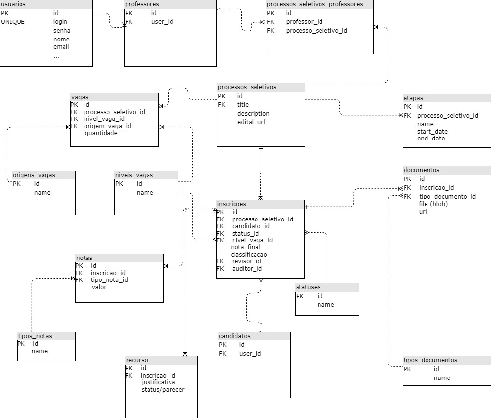

# Design

## Protótipo de Telas

Acompanhe [aqui](https://www.figma.com/file/j2yQ8paIOmyaE0sPTv3wHC/posgress?node-id=0%3A1) o protótipo das telas desenvolvido no Figma.

## Modelo Lógico de Dados

Primeira versão, identificando principalmente as tabelas e seus relacionamentos:

